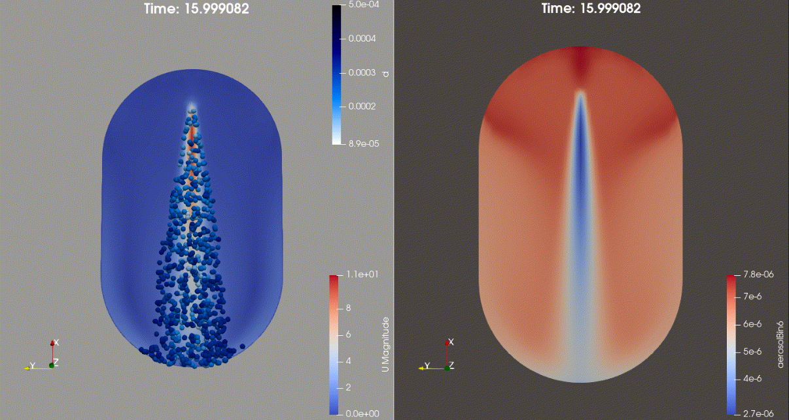

# aerosolSprayFoam
Custom aerosolSprayFoam based on Paper | "Numerical Simulation and Validation of Aerosol Particle Removal by Water Spray Droplets With OpenFOAM During the Fukushima Daiichi Fuel Debris Retrieval" | 

Purpose:
  Liang et al. aerosol washout benchmark solver with dynamic mesh support kept.
  This version uses the paper-consistent density-weighted aerosol mass-fraction
  equation instead of the previous number-concentration equation.

Active physics kept:
  - compressible gas momentum/pressure/rho
  - Lagrangian spray droplets
  - two-way droplet drag/source terms
  - Eulerian aerosolBin0...aerosolBin8 transport as mass fractions Yi [-]
  - aerosol capture by inertial impaction, interception, Brownian diffusion
  - optional dynamic mesh via dynamicFvMesh

Removed/disabled for paper consistency:
  - EEqn.H is not included
  - YEqn.H is not included
  - combustion model removed
  - radiation model removed
  - Qdot removed
  - thermophoresis/diffusiophoresis not included
  - MRF removed

Aerosol equation:
  d(rho*Yi)/dt + div(rho*U*Yi) - div(muEff grad Yi) = -rho*K_i*Yi

Field requirement:
  0/aerosolBin0 ... 0/aerosolBin8 must be dimensionless mass fractions.
  Do not initialize them as number concentration [#/m3].

Initialisation from paper bin mass:
  Yi_initial = M_i / (rho_air * V_domain)

  Example for the UTARTS vessel:
    V_domain = 3.92 m3
    rho_air about 1.2 kg/m3
    gas mass about 4.704 kg

    For AP6 case 1, M_i = 31.07 mg:
    Yi = 31.07e-6 / 4.704 = 6.60e-6

Benchmark advice:
  Use staticFvMesh in constant/dynamicMeshDict for the Liang et al. validation.
  Keep this dynamic-mesh solver only so you can later switch to moving/deforming
  mesh cases for thesis simulations.

Important compile note:
  OpenFOAM versions differ in pEqn.H helper-function signatures. If
  constrainPressure(...) fails, copy the signature from your installed
  rhoPimpleFoam/pEqn.H while keeping the no-MRF/no-energy structure.
